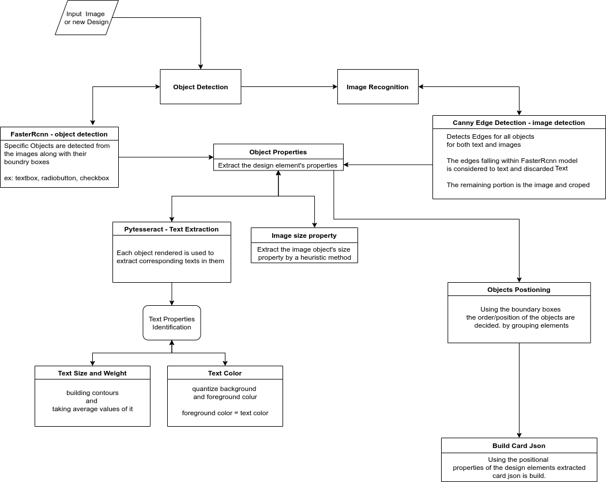
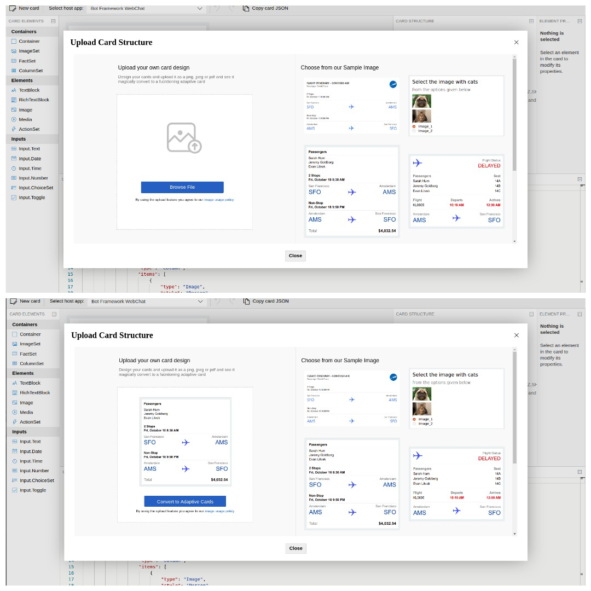
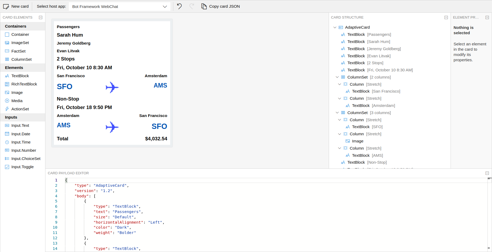

# Pic2Card

## Description
Pic2Card is a solution for converting adaptive cards GUI design image into adaptive card payload Json.


## Architecture



## Process flow for card prediction
1. Using the service

    ```shell
    # Setup dependency under a virtualenv
    $ virtualenv ~/env
    $ . ~/env/bin/activate
    (env)$ pip install -r requirements.txt
    (env)$ pip install -r requirements-frozen_graph.txt # tf specific only

    # Start the service.
    (env)$ python -m app.main

    # Hit the API using curl
    $ (env) curl --header "Content-Type: application/json" \
            --request POST \
            --data '{"image":"base64 of the image"}' \
            https://localhost:5050/predict_json
    ```





2. Using command

```
   python -m commands.generate_card  --image_path="path/to/image"
```
3. Docker Image

You can build a docker image from the source code and play with it.

Docker build supports two types of image generation,

a. A single image which embed frozen model with it.

b. Image which has only the service layer, the model will be consumed from the
   tensorflow serving. Right now this part is experimental state only.

```bash

# Build the image with frozen model.
$ docker build --build-arg TARGET_API=frozen_graph \
            --build-arg tfs_enable=\
            -t <username>/<container-name:tag> .

# Run the container,
$ docker run -it --name pic2card -p 5050:5050 <image:name:tag>

```
   ​
## Training
After the [Tensorflow ,Tensorflow models intsallation](https://tensorflow-object-detection-api-tutorial.readthedocs.io/en/latest/install.html):

1. Lable the  train and test images using - [labelImg](https://github.com/tzutalin/labelImg).

1. create csv files for train and test dataset

  ```shell
  python commands/xml_to_csv.py
  ```

  ```python
  #Which will generate the label mapping like:
    filename  width  height    class  xmin  ymin  xmax  ymax
  0   64.xml    576     814  textbox    24    31   407    81
  1   64.xml    576     814  textbox    15   109   322   157
  2   64.xml    576     814  textbox   337   112   560   151
  3   64.xml    576     814  textbox   256   176   543   294
  4   64.xml    576     814  textbox    93   358   506   432
  ```

  ​

2. set configs for generating tf records

  ```python
  # TO-DO replace this with label map
  def class_text_to_int(row_label):
      if row_label == 'textbox':
          return 1
      if row_label == 'radiobutton':
          return 2
      if row_label == 'checkbox':
          return 3
      else:
          None
  ```

  ```shell
  #Generate tf records for training and testing dataset
  python commands/generate_tfrecord.py \
     --csv_input=/data/train_labels.csv \
     --image_dir=/data/train \
     --output_path=/tf_records/train.record

  python commands/generate_tfrecord.py \
     --csv_input=/data/test_labels.csv \
     --image_dir=/data/test \
     --output_path=/tf_records/test.record

  ```

  ​

3. Edit training/object-detection.pbxt file to match the label maps mentioned in generate_tfrecord.py

4. download any pre trained tensorflow model from [here](https://github.com/tensorflow/models/blob/master/research/object_detection/g3doc/detection_model_zoo.md)

5. set below paths appropriately in pipeline.config file

  ```
  num_classes:number of labels/classes
  fine_tune_checkpoint: path to pre-trained faster rcnn tensorflow model
  train_input_reader.input_path: path to train tf.record
  eval_input_reader.input_path: path tp test tf.record
  label_map_path: path to object-detection.pbtxt label mapping
  ```

  ​

6. train model using below command

  ```shell
  python commands/train.py \
     --logtostderr \
     --model_dir=training/ \
     --pipeline_config_path=../training/pipeline.config
  ```

  ​

7. export inference graph

  ```shell
  #After the model is trained, we can use it for prediction using inference graphs
  #change XXXX to represent the highest number of trained model

  python commands/export_inference_graph.py \
     --input_type image_tensor \
     --pipeline_config_path training/pipeline.config \
     --trained_checkpoint_prefix training/model.ckpt-XXXX \
     --output_directory ../inference_graph
  ```

8. Can view the rcnn trained model's beaviour using the Jupyter notebook available under notebooks

## Testing

Unit tests have been written with python unittest module. Can run the tests module
using the following commands

To run all tests

```
python -m unittest discover
```
