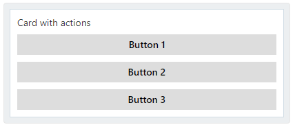
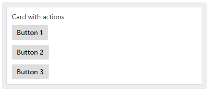
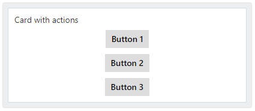
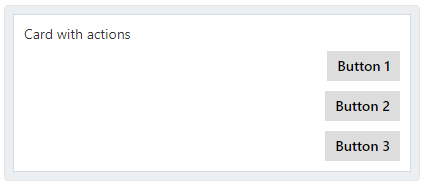
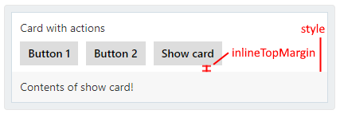

<!-- AUTO-GENERATED: This section is auto-generated from schemas/adaptive-card.json. Do NOT add anything above this or edit anything inside, it MUST be the first thing in the document and will be overwritten. -->

# ActionSet

#### Introduced in version 1.2

| Property | Type | Required | Description | Version |
| -------- | ---- | -------- | ----------- | ------- |
| **items** | `array[]` | Yes | The actions to include in the `ActionSet` | 1.2 |
| **type** | `string` | Yes | &nbsp; | 1.2 |
| **id** | `string` |  No | A unique identifier associated with the element. | 1.2 |
| **spacing** | `string` |  No | Controls the amount of spacing between this element and the preceding element. | 1.2 |
| **separator** | `boolean` |  No, default: `false` | When `true`, draw a separating line at the top of the element. | 1.2 |
<!-- END AUTO-GENERATED -->

## Rendering

### Icon style of buttons

1. If ALL actions have a valid `iconUrl`...
	1. Respect the `hostConfig.actions.iconPlacement` property.
	1. If `iconPlacement` is `aboveTitle` then the `hostConfig.actions.iconSize` should be used as the **height** of the image, while maintaining aspect ratio. Card Authors should use square images for ideal portability between Hosts.
	1. If `iconPlacement` is `leftOfTitle` then the image **SHOULD BE** as close as possible to the height of the text in the action. If that isn't reasonable then `hostConfig.actions.iconSize` should be used for the height.
1. Else if only SOME have a valid `iconUrl`...
	1. Use `leftOfTitle` to ensure that all buttons are rendered with the same height.
1. Else if NONE have a valid `iconUrl`...
	1. Display as text-only buttons

Renderers must set the per-platform styling name corresponding to the style chosen, so that hosts can style accordingly. For example, if the style ended up being `aboveTitle`, then the platform style should be something like `ActionWithIconAboveTitle`.

### Orientation and alignment of buttons

The orientation and alignment is determined by a combination of `hostConfig.actions.actionsOrientation` and `hostConfig.actions.actionAlignment`.

| | Horizontal | Vertical |
|--|--|--|
| **Stretch** |  |  |
| **Left** |  |  |
| **Center** |  |  |
| **Right** |  |  |

### Overflowing of actions...

How to handle actions overflowing is undetermined right now. Renderers could place them in a scroll view, choose to wrap buttons to the next row, etc. Our renderers currently do neither.

### Max actions

Renderers must respect the `hostConfig.actions.maxActions` value. If the actions provided in a single ActionSet exceed that number, the actions exceeding must be dropped, and a warning should be fired.

### Spacing between buttons

The spacing between buttons is specified in `hostConfig.actions.buttonSpacing`. Renderers must render the spacing between buttons as specified.

 

### ShowCard actions

When ShowCard actions are clicked, they must be displayed as follows...

1. If the ShowCard's card doesn't have a `style` set, set the style to the value in `hostConfig.actions.showCard.style`.
1. If `hostConfig.actions.showCard.actionMode` is set to `inline`...
	1. Wherever appropriate, display the card inline. Here's how our renderers do it...
	1. In a separate row beneath the ActionSet, render and show the ShowCard card. Render it as if `bleed` is true on the card, so that the style on the card reaches to the edges.
	1. For the spacing between the ActionSet and the row for the ShowCard card, use the value in `hostConfig.actions.showCard.inlineTopMargin`.
	1. 
	1. If the user clicks on the action for the currently open ShowCard, that should collapse the ShowCard card.
	1. If the user clicks on a different ShowCard action while another ShowCard is displayed, it should switch to that different action's card. 
1. Otherwise, trigger the `ActionInvoked` event. Hosts are responsible for displaying the popup if they changed the mode to popup.